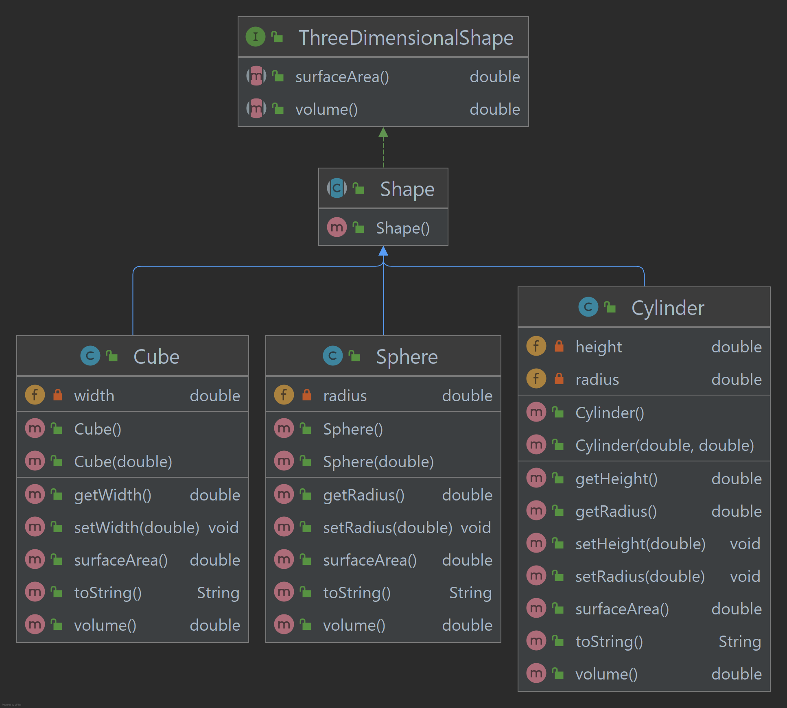

# Project 2
### Objectives
This assignment is designed to help you apply what you've learned about inheritance in Object-Oriented design.

### Concepts Covered
* Inheritance

### Details
* Review material on inheritance.  If you need a reference, try the tutorial found here https://www.tutorialspoint.com/java/java_inheritance.htm (Links to an external site.)
* Fork, then clone the project template from https://github.com/UltimateSandbox/project-2-initial.git (Links to an external site.)
* Complete the following programming assignment:
* Design and implement a set of classes, based on the UML below, that define a series of three-dimensional geometric shapes.
* For each shape, store fundamental data about its size and provide methods to access and modify this data. 
* For each shape, provide appropriate methods to compute each shape’s surface area and volume given the appropriate inputs. 
* You should implement at least four shapes, the 3 specified in the UML, plus one other of your choice.
* Modify the driver class provided to instantiate several shapes of differing types and exercise the behavior you provided.  (i.e. print out it's state using the toString() method.)
```
Hint:  
There are many types of 3 dimensional geometric shapes
to include in your design.  Try Googling 'list of 3d shapes' 
and see what you can come up with!
```
* The toString() method should print the name of the shape, its volume, and its surface area.  Take a look at the sphere class for an example of how this is done.
```text
Hint:  
Use the auto-generate feature in the IDE 
to generate the toString() method and add the necessary data to it.
```


### Expected Output
Once you get your code working, when you run the driver, you should see something similar to the following:
```text
Sphere {radius=2.0, surface area=50.26548245743669, volume=33.510321638291124}
Cube {width=5.0, surface area=150.0, volume=125.0}
Cylinder {height=4.0, radius=1.0, surface area=31.41592653589793, volume=12.566370614359172}
```

### Extra Credit
* If you would like up to 10 points extra credit for this assignment, have ChatGPT generate the volume and surfaceArea methods for your shapes.  You can try to have it generate the whole class, but that will probably be a bit more work manipulating the AI to do your bidding.
* Probably the easiest way to get the AI to generate the two methods is to ask it for a shape class (Sphere, for example) and explicitly ask it to include the methods you want.  You'll also need to specify the variable names that you want it to use as well so you don't have to change anything about the two methods once they are generated.
* As usual, to get the points, you'll need to paste the text of what you asked the AI to generate for you in a multi-line comment at the top of each of your shape classes.  The text must include a mention of the two methods (at least), as well as specifics on variable names.  The wording is up to you.

### Helpful Hints
* Utilize the Math class for the algorithm implementations.
* When implementing the algorithms, watch out for accidental integer division.  (3 is not the same type as 3.0)
* Utilize Google to find the formulas you're going to implement.
* Make good use of whitespace and comments to make your implementation as clean as possible.
* Use good, SOLID object-oriented programming principles (pun intended) in your implementation.

### Deliverables
* Be sure you commit & push your code to GitHub.  If you don't push it, I won't be able to see it!
* Copy the URL for your repo (green button on your GitHub repos' page) and paste it into the Website URL field and click Submit Assignment!
